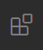
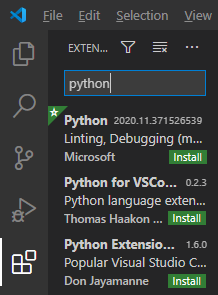
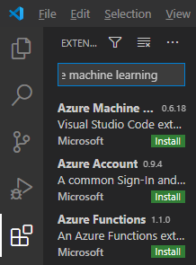
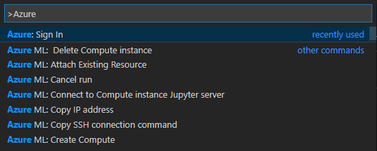
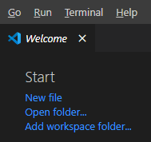
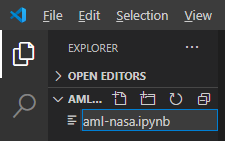

# Setting up your local environment for data science coding in Visual Studio Code

Before jumping into the module, be sure to make sure your environment is setup and ready to go. For this module, you will need a coding editor (we use Visual Studio Code), Python, Anaconda, and Jupyter notebooks (we use the Python extension for Visual Studio Code). 

If you haven't yet installed Visual Studio Code, you can find guides on the [Visual Studio Code Learn to Code site](https://aka.ms/LearnOnVSCode). Here, you can also find a Coding Pack for Python for Windows that will install Python along with Visual Studio Code. If you're not on Windows, you can find a guide for seeting up your environment on the [Data Science in Visual Studio Code docs page](https://code.visualstudio.com/docs/python/data-science-tutorial).

## Install and set up an Anaconda environment

You will also want to setup a Python environment with all of the tools you will need for this module. A popular open-source tool for doing this in the data-science community is [Anaconda](https://www.anaconda.com/products/individual), which you can download for Windows, MacOS, or Linux at that link.

Once installed, open a command-line window and run the following code to create an environment called aml-nasa (or another name of your choice):

```console
conda create -n aml-nasa python=3.7 numpy pandas scikit-learn
```

Once the Anaconda environment has finished setting up, activate it with this line of code in the command line: 

```console
conda activate aml-nasa
```

You will also need to install the Azure Machine Learning SDK:

```console
pip install -U azureml-sdk[automl,explain]
```

Note that the `automl` and `explain` parameters will help out later in the section when running machine-learning jobs in Azure from Visual Studio Code.

Finally, you will need the AutoML training tools:

```console
pip install -U azureml-train-automl
```

## Setting up Visual Studio Code to integrate with Azure Machine Learning

Now it's time to switch over to Visual Studio Code to install three extensions. The first of these is the Visual Studio Code Python extension. To install it, click on the Extensions view in the Activity Bar on the side of Visual Studio Code.



Once the Extensions view is open, search for **Python** and install it.



Next, in the Extensions view, search for **Azure Machine Learning**. Install the first two extensions: **Azure Machine Learning** enables you to work with it from Visual Studio Code; **Azure Account** enables you to log into Azure from Visual Studio Code.



Now sign in to your Azure account. To do this, open the **Command Palette** (Ctrl+Shift+P) and select **Azure: Sign In**. This will open a browser tab from which you can sign into Azure.



## Setting up Visual Studio Code with a new Jupyter file

Once you have your environment setup, you should create a folder called aml-nasa wherever you store code on your computer. Once you have created that folder, open it in Visual Stduio Code: open Visual Studio Code, and from the Welcome tab, click **Open Folder**. You can also do this by clicking **File -> Open** and navigating to the folder you just created.



Create a new file in the aml-nasa folder called aml-nasa.ipynb by clicking on the new file icon next to the folder name in the Explorer.



Make sure the file opens into a notebook and that the Jupyter server is connected and the kernel is pointing to the desired Python version.


## Downloading the NASA data

Now you will need some data. You can download the historical rocket-launch data we will use in this module by heading to the [RocketLaunchDataCompleted.csv on GitHub]() and downloading the CSV file. Make sure you save the data in a file called player_data.csv and save it in the aml-nasa folder you just created.